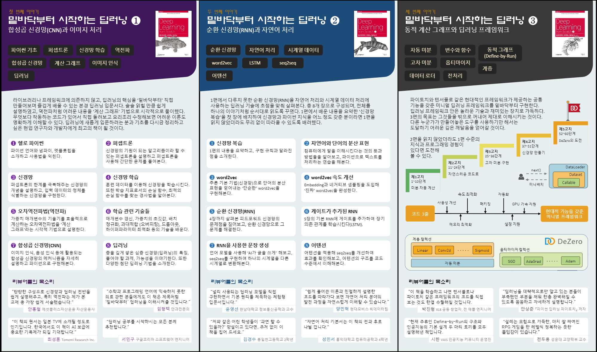

# 『밑바닥부터 시작하는 딥러닝』

&#x1F4D8;<u>__딥러닝을 더 깊이있게 공부해 보고자, 1~3권 모두 복습 차원에서 다시 공부를 진행__</u>

---

## 책 시리즈 소개
- [『밑바닥부터 시작하는 딥러닝 ①』 깃허브 저장소](https://github.com/WegraLee/deep-learning-from-scratch)
    -  __합성곱 신경망(CNN)과 이미지 처리__

 

- [『밑바닥부터 시작하는 딥러닝 ②』 깃허브 저장소](https://github.com/WegraLee/deep-learning-from-scratch-2)
    - __순환 신경망(RNN)과 자연어 처리__

 

- [『밑바닥부터 시작하는 딥러닝 ③』 깃허브 저장소](https://github.com/WegraLee/deep-learning-from-scratch-3)
    - __동적 계산 그래프와 딥러닝 프레임워크__

## 요구사항
소스 코드를 실행하려면 아래의 소프트웨어가 설치되어 있어야 합니다.

* 파이썬 3.x
* NumPy
* Matplotlib

※ Python은 3 버전을 이용합니다.